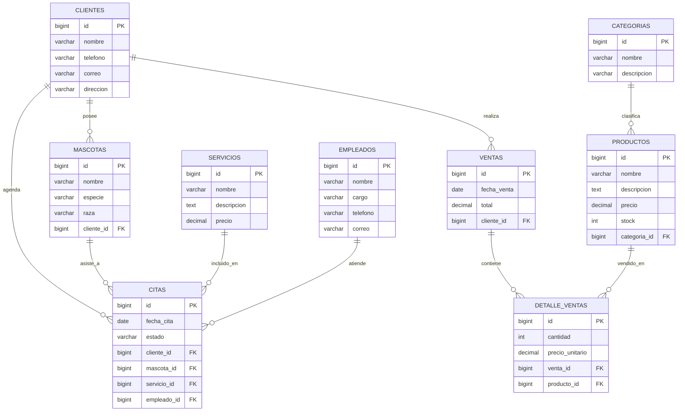

# Análisis de la Veterinaria Huellitas
## 1. Datos generales. 
- **Nombre**: Veterinaria Huellitas. 
- **Giro**: Veterinaria Huellitas es un centro de salud animal (veterinaria) y tienda para mascotas, ofreciendo diferentes artículos a sus clientes como medicamentos, alimentos para mascotas y distintos servicios como lo sería la consulta, vacunación, baño y peluquería. 
- **Tipo**: Es una *pequeña* empresa. 

## 2. Procesos. 
- **ventas**: Para realizar una venta, el cliente (personas naturales dueñas de mascotas) ingresa a la tienda y solicita el producto que necesita, la recepcionista verifica disponibilidad del producto y las diferentes marcas que maneja, el cliente indica la cantidad que necesita y la recepcionista registra manualmente el nombre del producto, cantidad, precio (producto + cantidad + precio = total por producto), llevando un registro manual de las ventas realizadas en el día. 
Se debe tener en cuenta que al ser un proceso manual no se actualiza el stock de manera automática al momento de realizar la venta, por ende, se sabe la cantidad de productos que se han vendido en el momento que se decide hacer la revisión de inventarios, se lleva una cuenta superficial al momento de realizar cierre de caja. 
 - **servicios**: En este caso se manejan dos escenarios, las _emergencias_ y las _consultas agendadas previamente_ 
 En el caso de las emergencias, el dueño se dirige a la tienda con la mascota indicando en recepción los síntomas que este tiene, la recepcionista verifica la disponibilidad de un veterinario, se atiende a la mascota y al finalizar se le indica al dueño el costo de los procedimientos necesarios, costo de la medicación utilizada y si el dueño decide adquirir el medicamento en la misma veterinaria, se sigue el mismo flujo anterior de producto/servicio + cantidad + precio = total. 
 En caso tal de ser una cita agendada previamente, el cliente se comunica con la recepcionista, esta indica veterinarios disponibles y los respectivos horarios en los cuales puede solicitar la cita, se verifica el día en el que el cliente desea la consulta y se le agenda al respectivo veterinario, todo este proceso se lleva en un excel. 

- **Compras**: En la tienda se verifica la cantidad de stock disponible de cada producto (cada producto tiene un stock mínimo dependiendo de la demanda que tenga), en el momento en el que verifican que el stock es bajo se contactan con el proveedor, solicitan la cantidad necesaria, se genera la orden de compra, se recibe la mercancía, se verifica la cantidad recibida con la OC y se actualiza el inventario del momento sumando la cantidad de productos recibidos. 

- **Inventarios**: Cada cierto tiempo se agenda la veterinaria para hacer una revisión de inventarios donde se verifica la cantidad de productos que no pueden vender (vencidos, dañados), generando el total, además, en cada cierre se tiene en cuenta la cantidad de unidades que vendieron de los productos para descontarlo del inventario base. Este método es obsoleto ya que, en caso tal de que la recepcionista no anote uno de los productos vendidos se genera un descuadre en caja y en inventarios.

- **Clientes**: La tienda no maneja un registro de los clientes que tiene, estos no son registrados en una base de datos, cuando necesitan tener contacto con algún cliente guardan la información en un excel, a los clientes se les hace entrega del recibo donde se muestra el proceso realizado, pero, este no funciona como historial clínico.

## 3. Problemas detectados.
- Manejan la información de inventarios, ventas y mascotas de forma dispersa entre cuadernos y excel, sin tener una conexión entre sí, en el caso de los clientes lleva a no tener información previa con respecto a los tratamientos de la mascota (no se maneja ningún tipo de historial, la información siempre debe ser brindada por el cliente), en inventarios se maneja una mala gestión del stock, en caso tal de que la recepcionista o el veterinario no anote uno de los medicamentos o productos vendidos no se actualiza correctamente, y en las ventas, al ser completamente manual puede haber fallos a la hora de digitar el total o en el momento que no se anote una venta se genera un descuadre en caja. Llevan una mala gestión de las ordenes de compra, ya que solo descuentan de caja el total pagado para no generar descuadres en el cierre, pero, no llevan un historial de compra (importante en las empresas para analizar los productos con una mayor demanda)
- No manejan un sistema de agendamiento centralizado, al ser un proceso manejado por agendas puede ocurrir que se brinde la cita a dos mascotas en el mismo momento, no se tiene un buen control de la disponibilidad del tiempo. 

- Al manejar la información de una manera desorganizada no es posible manejar KPIs que ayuden a mejorar el negocio a futuro. 

## 4. Justificación de ERP. 

La veterinaria huellitas maneja tres tipos de operaciones al mismo tiempo, el servicio veterinario, ventas de productos y gestión del inventario, estos tres procesos están desconectados entre sí al registrarse en distintos medios. Un ERP sería efectivo para centralizar la información en una base de datos y unir los procesos, evitando lo que sería la pérdida de información, los errores de inventario. 

En los inventarios permitiría ingresar de una manera más sencilla la cantidad de productos que se encuentran disponibles, también, le permite al personal buscar rápidamente la cantidad disponible de x producto sin tener que verificar físicamente, notificando el momento en el que cada producto tiene un stock mínimo para realizar su pedido con proveedores. 

En las ventas, se llevaría una mejor gestión de la caja, registrando cada producto y dando el total de cada factura, además, esta área se conecta directamente con inventarios, por cada venta realizada se descuenta el producto del inventario, este proceso dejaría de ser manual. 

En las compras el ERP permite saber a qué proveedor se le ha comprado cierta cantidad de productos, llevando una mejor gestión de la cantidad de ingresos y egresos que maneja la veterinaria (todo va ligado a una OC), este proceso se conectaría con el cuadre de caja al final del día. 

En el agendamiento de citas el ERP permite centralizar el calendario por veterinario, evitando el doble agendamiento o que se cancele una cita a última hora por desconocimiento de esta. 

Al manejar una base de datos de los clientes se puede manejar un historial clínico donde se conoce mejor a las mascotas y los procesos realizados, además, permite tener conocimiento de los clientes frecuentes, esto puede llevar a actividades de enganche a futuro. 

Este ERP puede llevar a generar indicadores a futuro que permitan mejorar el funcionamiento de la veterinaria. 

## 5. Diagrama ER. 

> **Nota de nomenclatura:** el diagrama ER (sección 5) usa nombres en español para que sea fácil de leer (`CLIENTES`, `nombre`, `mascota_id`). En la base de datos y el código Laravel se usan los nombres en inglés (`clients`, `name`, `pet_id`), como es convención del framework. La equivalencia es directa: CLIENTES→`clients`, MASCOTAS→`pets`, PRODUCTOS→`products`, CATEGORIAS→`categories`, SERVICIOS→`services`, CITAS→`appointments`, VENTAS→`sales`, EMPLEADOS→`employees`, DETALLE_VENTAS→`sale_items`.

## 6. Diccionario de Datos.

Se documentan las tres tablas implementadas en el parcial (coinciden con las migraciones en `database/migrations/`). Todas incluyen además `created_at` y `updated_at` (`TIMESTAMP`, nullable), generadas por `$table->timestamps()`.

### Tabla: clients (dueños de mascotas)

| Tabla | Campo | Tipo | Nulo | Descripción |
|---|---|---|---|---|
| clients | id | BIGINT UNSIGNED, PK, auto-increment | No | Identificador único del cliente |
| clients | name | VARCHAR(150) | No | Nombre completo del dueño de la mascota |
| clients | phone | VARCHAR(20) | Sí | Teléfono de contacto |
| clients | email | VARCHAR(100) | Sí | Correo electrónico |
| clients | address | VARCHAR(200) | Sí | Dirección de residencia |
| clients | created_at / updated_at | TIMESTAMP | Sí | Fechas de creación y actualización del registro |

### Tabla: pets (mascotas / pacientes)

| Tabla | Campo | Tipo | Nulo | Descripción |
|---|---|---|---|---|
| pets | id | BIGINT UNSIGNED, PK, auto-increment | No | Identificador único de la mascota |
| pets | name | VARCHAR(100) | No | Nombre de la mascota |
| pets | species | VARCHAR(50) | No | Especie (perro, gato, etc.) |
| pets | breed | VARCHAR(50) | Sí | Raza |
| pets | client_id | BIGINT UNSIGNED, FK → clients.id | No | Dueño de la mascota (`ON DELETE CASCADE`) |
| pets | created_at / updated_at | TIMESTAMP | Sí | Fechas de creación y actualización del registro |

### Tabla: products (medicamentos, alimentos, accesorios)

| Tabla | Campo | Tipo | Nulo | Descripción |
|---|---|---|---|---|
| products | id | BIGINT UNSIGNED, PK, auto-increment | No | Identificador único del producto |
| products | name | VARCHAR(150) | No | Nombre del producto |
| products | description | TEXT | Sí | Descripción detallada |
| products | price | DECIMAL(10,2) | No | Precio de venta |
| products | stock | INT, default 0 | No | Unidades disponibles en inventario |
| products | created_at / updated_at | TIMESTAMP | Sí | Fechas de creación y actualización del registro |

**Relación implementada:** `clients` 1 ── N `pets` (un cliente tiene muchas mascotas; una mascota pertenece a un cliente).

**Alcance del parcial:** de las 8 entidades del diseño se implementan 3 (`clients`, `pets`, `products`). En una segunda fase, `products` recibirá `category_id` (FK → `categories`) y se crearán las demás tablas del diagrama.

## 7. Propuesta de Solución ERP.

### 7.1 Módulos del ERP

| # | Módulo | Función principal | Entidades |
|---|---|---|---|
| 1 | **Clientes** | Registro de dueños, datos de contacto e historial de compras y visitas. | clients |
| 2 | **Mascotas (historial clínico)** | Ficha de cada paciente: especie, raza, dueño y atenciones recibidas. | pets |
| 3 | **Productos e Inventario** | Catálogo, categorías, stock en tiempo real, stock mínimo y alertas de reposición. | products, categories |
| 4 | **Servicios** | Catálogo de servicios (consulta, vacunación, cirugía, baño, peluquería) con su precio. | services |
| 5 | **Citas (agenda)** | Agenda centralizada por veterinario/peluquero; evita el doble agendamiento. | appointments |
| 6 | **Ventas y Facturación** | Factura de productos y servicios, descuento automático de stock y cierre de caja. | sales, sale_items |
| 7 | **Empleados** | Veterinarios, auxiliares, recepcionistas y peluqueros; disponibilidad y atenciones por empleado. | employees |
| 8 | **Compras y Proveedores** | Órdenes de compra, recepción de mercancía y actualización automática del inventario. | (fase posterior) |
| 9 | **Reportes e Indicadores** | Tablero con KPIs para la toma de decisiones del dueño. | consulta sobre todos los módulos |

### 7.2 Cómo se relacionan los módulos (flujo completo)

**Cliente que llega con su mascota a una consulta:**

1. **Recepción** busca al dueño en **Clientes**. Si es nuevo, lo registra; luego selecciona o crea la mascota en **Mascotas**.
2. En **Citas** se verifica la disponibilidad del veterinario (**Empleados**) y se asigna el turno con el **Servicio** "Consulta". Si es una emergencia, se crea la cita en el momento con estado `en atención`.
3. El veterinario atiende a la mascota y las observaciones quedan asociadas a la cita, formando el **historial clínico** de la mascota.
4. Si se aplica un medicamento o el dueño compra alimento, en **Ventas** se agregan como líneas de la factura (servicio + productos). El sistema calcula el total automáticamente.
5. Al confirmar la venta, **Productos e Inventario** descuenta el stock de cada producto vendido, sin intervención manual.
6. Si el stock de algún producto cae por debajo del mínimo, se genera una alerta y **Compras** propone una orden de compra al proveedor. Al recibir la mercancía, el inventario se incrementa.
7. Al cerrar el día, **Reportes** consolida ventas, caja e inventario sin descuadres, porque todo salió del mismo registro.

### 7.3 Indicadores (KPIs)

| KPI | Cómo se calcula | Decisión que apoya |
|---|---|---|
| **Ventas diarias / mensuales** | Suma de `sales.total` por período | Medir el crecimiento y comparar meses |
| **Productos más vendidos** | Suma de `sale_items.cantidad` agrupada por producto | Decidir qué comprar más y qué promocionar |
| **Productos bajo stock mínimo** | Productos con `stock` ≤ stock mínimo | Anticipar pedidos y evitar quiebres de inventario |
| **Servicios más solicitados** | Conteo de `appointments` por servicio | Reforzar personal y horarios de mayor demanda |
| **Citas atendidas vs. canceladas** | Citas por `estado` / total de citas | Detectar ausentismo y mejorar la agenda |
| **Clientes frecuentes / nuevos** | Conteo de ventas y citas por cliente | Diseñar fidelización y promociones |
| **Ingresos por veterinario** | Suma de servicios facturados por empleado | Evaluar carga de trabajo y desempeño |

### 7.4 Beneficios para la veterinaria

1. **Inventario confiable:** el stock se actualiza solo con cada venta y cada compra, eliminando descuadres en caja e inventario.
2. **Historial clínico de cada mascota:** el veterinario conoce tratamientos y vacunas previas sin depender de lo que recuerde el dueño.
3. **Agenda sin cruces:** un calendario único por veterinario evita dar dos citas a la misma hora y reduce cancelaciones de último momento.
4. **Menos errores y tiempo perdido:** se eliminan los cuadernos y las hojas de cálculo dispersas; el total de la factura se calcula automáticamente.
5. **Decisiones basadas en datos:** los KPIs muestran qué se vende, qué servicios tienen demanda y cuándo reponer.
6. **Mejor relación con el cliente:** la base de datos permite identificar clientes frecuentes y contactarlos para recordatorios de vacunas y promociones.
