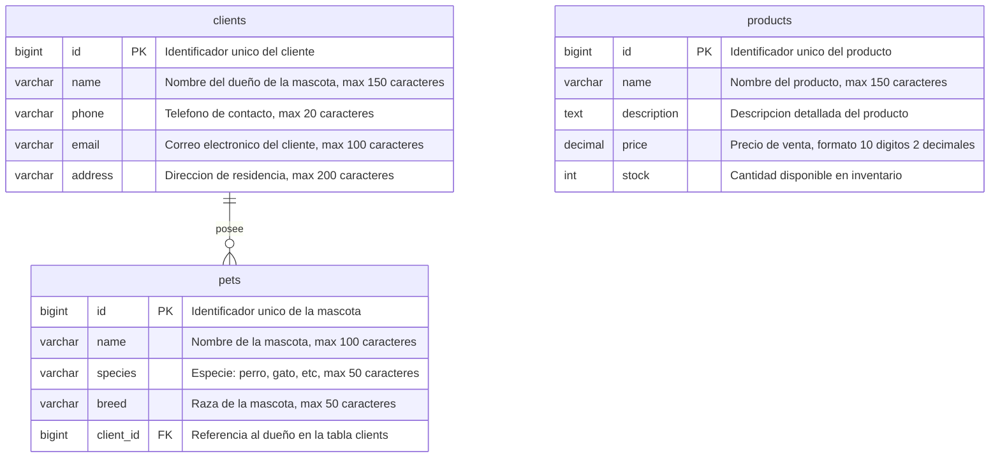

# Análisis de la Veterinaria Huellitas. 
## 1. Datos generales. 
- **Nombre**: Veterinaria Huellitas. 
- **Giro**: Veterinaria Huellitas es un centro de salud animal (veterinaria) y tienda para mascotas, ofreciendo diferentes articulos a sus clientes como medicamentos, alimentos para mascotas y distintos servicios como lo sería la consulta, vacunación, baño y peluquería. 
- **Tipo**: Es una *pequeña* empresa. 

## 2. Procesos. 
- **ventas**: Para realizar una venta, el cliente (personas naturales dueñas de mascotas) ingresa a la tienda y solicita el producto que necesita, la recepcionista verifica disponibilidad del producto y las diferentes marcas que maneja, el cliente indica la cantidad que necesita y la recepcionista registra manualmente el nombre del producto, cantidad, precio (producto + cantidad + precio = total por producto), llevando un registro manual de las ventas realizadas en el día. 
Se debe tener en cuenta que al ser un proceso manual no se actualiza el stock de manera automática al momento de realizar la venta, por ende, se sabe la cantidad de productos que se han vendido en el momento que se decide hacer la revisión de inventarios, se lleva una cuenta superficial al momento de realizar cierre de caja. 
 - **servicios**: En este caso se manejan dos escenarios, las _emergencias_ y las _consultas agendadas previamente_ 
 En el caso de las emergencias, el dueño se dirige a la tienda con la mascota indicando en recepción los síntomas que este tiene, la recepcionista verifica la disponibilidad de un veterinario, se atiende a la mascota y al finalizar se le indica al dueño el costo de los procedimientos necesarios, costo de la medicación utilizada y si el dueño decide adquirir el medicamento en la misma veterinaria, se sigue el mismo flujo anterior de producto/servicio + cantidad + precio = total. 
 En caso tal de ser una cita agendada previamente, el cliente se comunica con la recepcionista, esta indica veterinarios disponibles y los respectivos horarios en los cuales puede solicitar la cita, se verifica el día en el que el cliente desea la consulta y se le agenda al respectivo veterinario, todo este proceso se lleva en un excel. 

- **Compras**: En la tienda se verifica la cantidad de stock disponible de cada producto (cada producto tiene un stock mínimo dependiendo de la demanda que tenga), en el momento en el que verifican que el stock es bajo se contactan con el proveedor, solicitan la cantidad necesaria, se genera la orden de compra, se recibe la mercancía, se verifica la cantidad recibida con la OC y se actualiza el inventario del momento sumando la cantidad de productos recibidos. 

- **Inventarios**: Cada cierto tiempo se agenda la veterinaria para hacer una revisión de inventarios donde se verifica la cantidad de productos que no pueden vender (vencidos, dañados), generando el total, además, en cada cierre se tiene en cuenta la cantidad de unidades que vendieron de los productos para descontarlo del inventario base. Este método es obsoleto ya que, en caso tal de que la recepcionista no anote uno de los productos vendidos se genera un descuadre en caja y en inventarios.

- **Clientes**: La tienda no maneja un registro de los clientes que tiene, estos no son registrados en una base de datos, cuando necesitan tener contacto con algún cliente guardan la información en un excel, a los clientes se les hace entrega del recibo donde se muestra el proceso realizado, pero, este no funciona como historial clínico.

## 3. Problemas detectados.
- Manejan la información de inventarios, ventas y mascotas de forma dispersa entre cuadernos y excel, sin tener una conexión entre sí, en el caso de los clientes lleva a no tener información previa con respecto a los tratamientos de la mascota (no se maneja ningún tipo de historial, la información siempre debe ser brindada por el cliente), en inventarios se maneja una mala gestión del stock, en caso tal de que la recepcionista o el veterinario no anote uno de los medicamentos o productos vendidos no se actualiza correctamente, y en las ventas, al ser completamente manual puede haber fallos a la hora de digitar el total o en el momento que no se anote una venta se genera un descuadre en caja. Llevan una mala gestión de las ordenes de compra, ya que solo descuentan de caja el total pagado para no generar descuadres en el cierre, pero, no llevan un historial de compra (importante en las empresas para analizar los productos con una mayor demada)
- No manejan un sistema de agendamiento centralizado, al ser un proceso manejado por agendas puede ocurrir que se brinde la cita a dos mascotas en el mismo momento, no se tiene un buen control de la disponibilidasd del tiempo. 

- Al manejar la información de una manera desorganzida no es posible manejar KPIs que ayuden a mejorar el negocio a futuro. 


## 4. Justificación de ERP. 

La veterinaria huellitas maneja tres tipos de operaciones al mismo tiempo, el servicio veterinario, ventas de productos y gestión del inventario, estos tres procesos están desconectados entre sí al registrarse en distintos medios. Un ERP sería efectivo para centralizar la información en una base de datos y unir los procesos, evitando lo que sería la pérdida de información, los errores de inventario. 

En los inventarios permitiría ingresar de una manera más sencilla la cantidad de productos que se encuentran disponibles, también, le permite al personal buscar rápidamente la cantidad disponible de x producto sin tener que verificar físicamente, notificando el momento en el que cada producto tiene un stock mínimo para realizar su pedido con proveedores. 

En las ventas, se llevaría una mejor gestión en de la caja, registrando cada producto y dando el total de cada factura, además, esta área se conecta directamente con inventarios, por cada venta realizada se descuenta el producto del inventario, este proceso dejaría de ser manual. 

En las compras el ERP permite saber a qué proveedor se le ha comprado cierta cantidad de productos, llevando una mejor gestión de la cantidad de ingresos y egresos que maneja la veterinaria (todo va ligado a una OC), este proceso se conectaría con el cuadre de caja al final del día. 

En el agendamiento de citas el ERP permite centralizar el calendario por veterinario, evitando el doble agendamiento o que se cancele una cita a última hora por desconocimiento de esta. 

Al manejar una base de datos de los clientes se puede manejar un historial clínico donde se conoce mejor a las mascotas y los procesos realizados, además, permite tener conocimiento de los clientes frecuentes, esto puede llevar a actividades de enganche a futuro. 

Este ERP puede llevar a generar indicadores a futuro que permitan mejorar el funcionamiento de la veterinaria. 

## 5. Diagrama ER. 
```
mermaid
erDiagram
    CLIENTES ||--o{ MASCOTAS : "posee"
    CLIENTES ||--o{ CITAS : "agenda"
    CLIENTES ||--o{ VENTAS : "realiza"

    MASCOTAS ||--o{ CITAS : "asiste_a"

    CATEGORIAS ||--o{ PRODUCTOS : "clasifica"

    SERVICIOS ||--o{ CITAS : "incluido_en"

    EMPLEADOS ||--o{ CITAS : "atiende"

    VENTAS ||--o{ DETALLE_VENTAS : "contiene"
    PRODUCTOS ||--o{ DETALLE_VENTAS : "vendido_en"

    CLIENTES {
        bigint id PK
        varchar nombre
        varchar telefono
        varchar correo
        varchar direccion
    }

    MASCOTAS {
        bigint id PK
        varchar nombre
        varchar especie
        varchar raza
        bigint cliente_id FK
    }

    CATEGORIAS {
        bigint id PK
        varchar nombre
        varchar descripcion
    }

    PRODUCTOS {
        bigint id PK
        varchar nombre
        text descripcion
        decimal precio
        int stock
        bigint categoria_id FK
    }

    SERVICIOS {
        bigint id PK
        varchar nombre
        text descripcion
        decimal precio
    }

    EMPLEADOS {
        bigint id PK
        varchar nombre
        varchar cargo
        varchar telefono
        varchar correo
    }

    CITAS {
        bigint id PK
        date fecha_cita
        varchar estado
        bigint cliente_id FK
        bigint mascota_id FK
        bigint servicio_id FK
        bigint empleado_id FK
    }

    VENTAS {
        bigint id PK
        date fecha_venta
        decimal total
        bigint cliente_id FK
    }

    DETALLE_VENTAS {
        bigint id PK
        int cantidad
        decimal precio_unitario
        bigint venta_id FK
        bigint producto_id FK
    }
```

## 6. Diccionario de Datos. 




